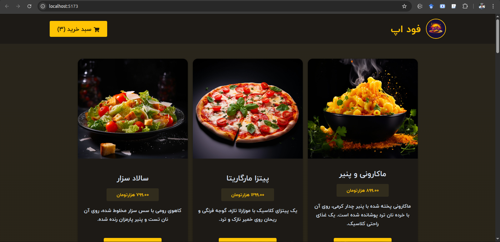
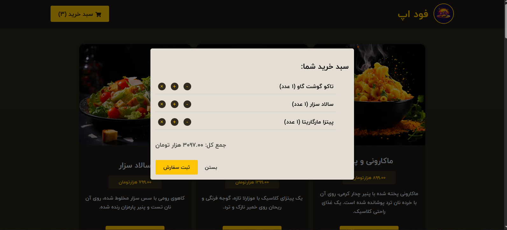

# 🍔 FoodApp

A simple food ordering web app built with **React (Vite)** for the frontend and **Node.js + Express** for the backend.  
Users can browse available meals, add them to a cart, and place an order.

---

## 📸 Screenshots

> Home Page
>   
> Cart Modal
> 

---

## 🚀 Features

- 🧾 View available meals  
- 🛒 Add / remove items to/from the shopping cart  
- 💳 Checkout with a simple modal  
- 🔔 Success confirmation modal  
- 📱 Responsive design (RTL Persian support)  
- 🌐 Backend API for meals and orders  

---

## 🧠 Tech Stack

### Frontend  
- React (Vite)  
- Context API (for Cart state management)  
- Persian digit formatting utility  
- CSS (custom styling, no Tailwind)  

### Backend  
- Node.js  
- Express.js  
- JSON-based data storage  

---

## 🗂 Folder Structure

```
.
├── backend
│   ├── app.js                  # Express backend entry  
│   ├── data
│   │   ├── available-meals.json  
│   │   └── orders.json  
│   ├── package.json  
│   └── package-lock.json  
│
├── index.html                  # Vite entry HTML  
├── package.json  
├── package-lock.json  
│
├── src
│   ├── api
│   │   └── mealsApi.js         # Fetch meals from backend  
│   ├── App.jsx  
│   ├── assets
│   │   └── logo.jpg  
│   ├── components
│   │   ├── Header.jsx  
│   │   ├── Meals
│   │   │   ├── MealItem.jsx  
│   │   │   └── MealsList.jsx  
│   │   └── Modals
│   │       ├── Cart.jsx  
│   │       ├── Checkout.jsx  
│   │       └── SuccessModal.jsx  
│   ├── config
│   │   └── env.js  
│   ├── context
│   │   └── CartContext.jsx  
│   ├── hooks
│   │   └── useMeals.js  
│   ├── index.css  
│   ├── main.jsx  
│   └── utils
│       └── convertToPersianDigits.js  
│
└── vite.config.js  
```

---

## ⚙️ Setup & Run

### 1️⃣ Clone the repository  
```bash
git clone https://github.com/your-username/foodapp.git  
cd foodapp  
```

---

### 2️⃣ Run the Backend  
```bash
cd backend  
npm install  
npm start  
```

Backend runs by default on [http://localhost:3000](http://localhost:3000).

---

### 3️⃣ Run the Frontend  
In another terminal (project root):  
```bash
npm install  
npm run dev  
```

Frontend runs on [http://localhost:5173](http://localhost:5173).

---

## 🧩 Environment Variables

Create a file at `src/config/env.js` if you want to customize your API endpoint:

```js
export const API_BASE_URL = "http://localhost:3000";
```

---

## 💡 Persian Digit Conversion Utility

Utility located at `src/utils/convertToPersianDigits.js` converts English digits to Persian numerals for UI consistency.

---

## 🧾 License

This project is open-source and available under the [MIT License](./LICENSE).

---

## 💬 Author

**Sajjad Alizadeh**  
📧 sajjadalizadeh275800@gmail.com
🌐 [Portfolio Website](https://sam-alizadeh.ir)
